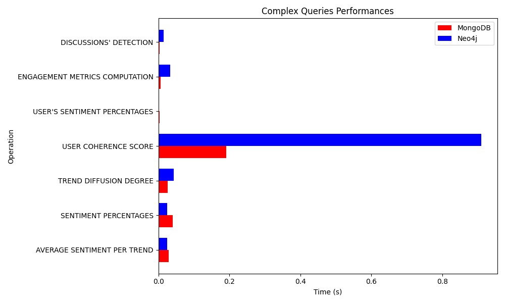
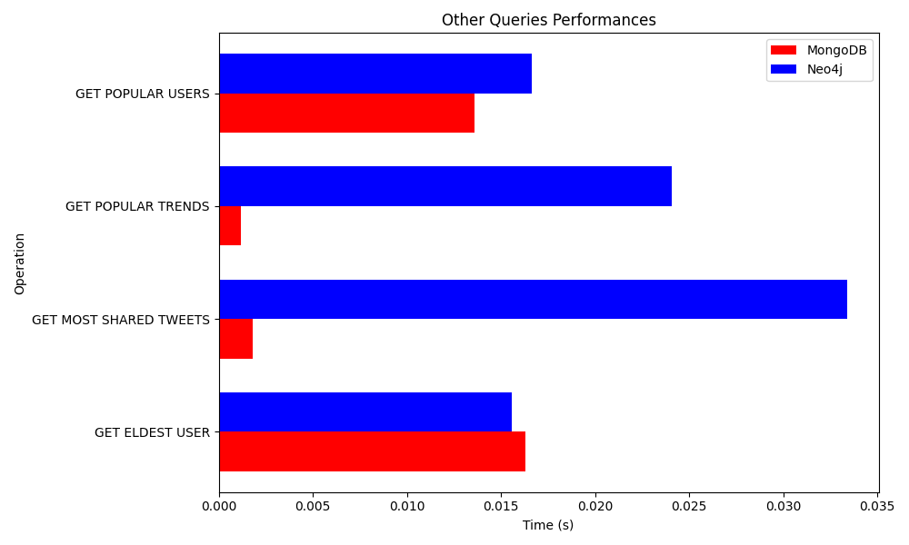

# TwitterSentimentAnalysisGraphDB

This project aims at importing a previous MongoDB NoSQL document-based database for the sentiment analysis of the Tweets in Neo4j. The main objective is to compare performances between the two different systems on the selected queries of interest.

## Database

The database module contains:

* the `CRUD` folder, containing the CRUD operations,
* the `data` folder, containing the JSON files with the data to be loaded into the database,
* the `queries` folder containing the main operations to be performed in the database,
* the `db_manager.py` file which contains a manager class, with the aim of performing the main operations on the nodes and the relationships of the database,
* the `model.py` file.

### `model.py`

In order to deal with the graph database in Neo4j in a simpler way, I decided to use `neomodel` as `OGM` ([Object Graph Mapper](https://www.google.com/url?sa=t&rct=j&q=&esrc=s&source=web&cd=&cad=rja&uact=8&ved=2ahUKEwjIv8Lq092CAxUwcvEDHcxcCBQQFnoECBcQAQ&url=https%3A%2F%2Fneo4j.com%2Fdocs%2Fogm-manual%2Fcurrent%2Fintroduction%2F&usg=AOvVaw3V8X64u8nYqBvVITygMH__&opi=89978449)), which is based on the `neo4j` python driver. This file contains the classes mapping the *nodes* and the *reationships* of the database.

### `db_manager.py`

The manager performs the connection to the database during the initialization and allows to perform the more general operations.

## CRUD

### `create.py`

This file contains some functions to create trends, tweets, users or comments.

### `read.py`

This file contains some functions to read trends for a given tweet, tweets for a given trend, the user who wrote a tweet, the tweets for a given user or the comments for a given tweet.

### `update.py`

This file contains some functions to update trends, tweets, users or comments.

### `delete.py`

This file contains some functions to delete trends, tweets, users or comments.

## Queries

### `complex_queries.py`

This file contains a function for each of the 7 main queries performed by this database in its original version.

### `other_queries.py`

This file contains other simpler general functions to be performed in the database.

## Performances comparison

In the following figure are plotted the benchmarks of the queries in the file `complex_queries.py` in both the original document-based DMS and the graph-based one.

In the following figure are plotted the benchmarks of the queries in the file `other_queries.py` in both the original document-based DMS and the graph-based one.

